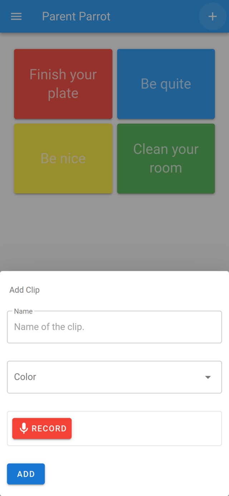

# Parent Parrot

I was looking for a fun project to explore building an audio recorded and player within the browser using JavaScript, and Parent Parrot is the result. If you find yourself saying things over and over to your kids, Parent Parrot comes for rescue. It will enable you to record your frequently used sentences, such as _finish your food_, _be quite_, and play them back to your kids as many times as needed.



## Building Project

Start by installing the dependencies.

```bash
npm install
```

Compile and minify the project.

```bash
npm run build
```

## Running Locally

Start the web server.

```
npm run serve
```

## License

Icons made by [Freepik](https://www.flaticon.com/authors/freepik) from [Flaticon](https://www.flaticon.com/).

Copyright (c) 2019 Onur Cinar. All Rights Reserved.

The source code is provided under GNU GPL Version 3 License.

